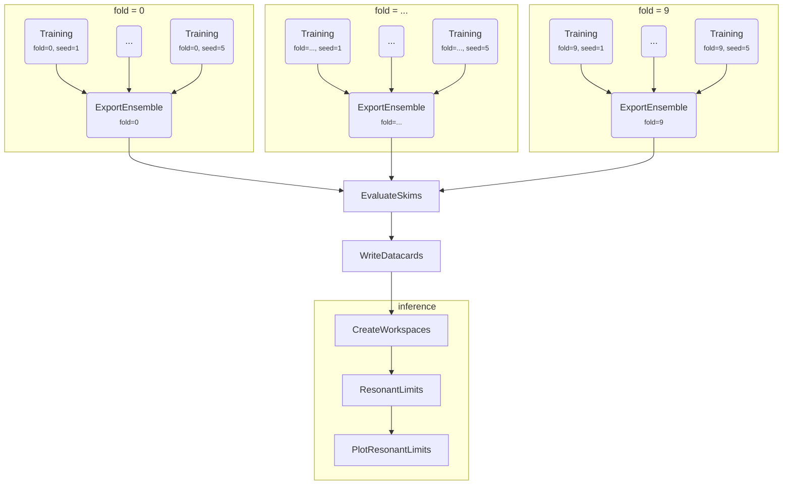

# tautauNN

Training pipeline for the resonant HH → bb𝛕𝛕 search at CMS.

## Setup

```shell
source setup.sh
```

## Tasks


```mermaid
graph TD
    training01(Training<br/><span style="font-size:12px;">fold=0, seed=1</span>)
    training0X(...)
    training0N(Training<br/><span style="font-size:12px;">fold=0, seed=5</span>)

    trainingX1(Training<br/><span style="font-size:12px;">fold=..., seed=1</span>)
    trainingXX(...)
    trainingXN(Training<br/><span style="font-size:12px;">fold=..., seed=5</span>)

    training91(Training<br/><span style="font-size:12px;">fold=9, seed=1</span>)
    training9X(...)
    training9N(Training<br/><span style="font-size:12px;">fold=9, seed=5</span>)

    ensemble0(ExportEnsemble<br/><span style="font-size:12px;">fold=0</span>)
    ensembleX(ExportEnsemble<br/><span style="font-size:12px;">fold=...</span>)
    ensemble9(ExportEnsemble<br/><span style="font-size:12px;">fold=9</span>)

    subgraph "fold = 0"
        training01 --> ensemble0
        training0X --> ensemble0
        training0N --> ensemble0
    end

    subgraph "fold = ..."
        trainingX1 --> ensembleX
        trainingXX --> ensembleX
        trainingXN --> ensembleX
    end

    subgraph "fold = 9"
        training91 --> ensemble9
        training9X --> ensemble9
        training9N --> ensemble9
    end


    ensemble0 --> EvaluateSkims
    ensembleX --> EvaluateSkims
    ensemble9 --> EvaluateSkims

    EvaluateSkims --> WriteDatacards
    WriteDatacards --> CreateWorkspaces

    subgraph "&nbsp;&nbsp;&nbsp;&nbsp;&nbsp;&nbsp;&nbsp;&nbsp;&nbsp;&nbsp;&nbsp;&nbsp;&nbsp;&nbsp;&nbsp;&nbsp;&nbsp;&nbsp;&nbsp;&nbsp;inference"
        CreateWorkspaces --> ResonantLimits
        ResonantLimits --> PlotResonantLimits
    end
```
